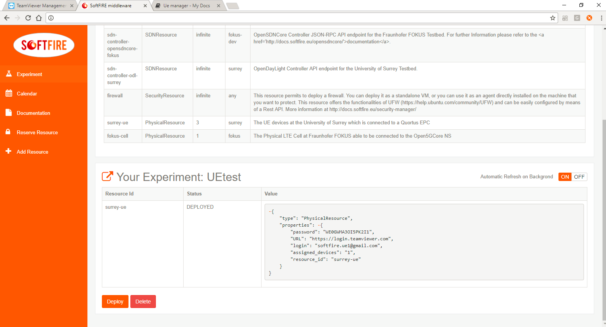
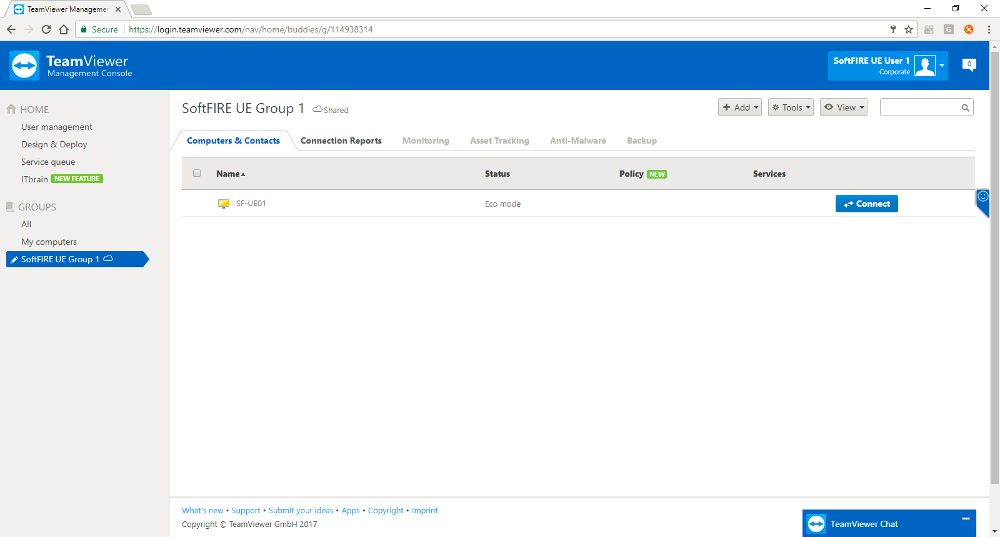

# Physical Device Manager

The Physical Device Manager provides reservation of physical resources. For the third wave, experimenters may reserve UE(s) at the Surrey test bed, and remotely control them using [TeamViewer](https://www.teamviewer.com).

The PhysicalResource node type is defined as follows, as per [node types page][node_types]:

```yaml
PhysicalResource:
    derived_from: eu.softfire.BaseResource
    description: "Defines a Physical resource request in the SoftFIRE Middleware"
	properties:
      resource_name:
        required: true
        type: string
```

As such, the only parameters that need to be specified are the **resource_name**, as well as the **resource_id** which is a required parameter of the BaseResource type.

!!! note
    Due to the limited number of physical resources, it is recommended to specify a start and end date as defined in the BaseResource type, to avoid unnecessarily holding up resources for an extended period of time. Failure to specify this may result in your experiment being rejected.

## UE Physical Resource
### UE Reservation
In the case of a UE reservation, the resource_id is **surrey-ue**. Therefore, reserving a UE can be done by including the following under *node_templates* in the experiment.yaml file for each UE to reserve:

```yaml 
<resource-name>:
	properties:
		resource_id: surrey-ue
		resource_name: <resource-name>
		start-date: <YYYY-MM-DD>
		end-date: <YYYY-MM-DD>
	type: PhysicalResource
```

where <***resource-name***> is a unique name to be assigned to the UE.

The following diagram shows the procedure for reserving and terminating UE resources:

<center></center>

### UE Control
After deploying an experiment with a UE physical resource, the TeamViewer login credentials will appear under the properties of your experiment, as shown in the following example:

[](img/ue-reservation-em.png)

Using these credentials, the experimenter can log in to TeamViewer and view the list of reserved UEs that can be controlled, as shown in the example below. These will be displayed under the group name "SoftFIRE UE Group X"; (X=1...3).

[](img/ue-reservation-tv.png)

To connect to a UE, click the "Connect" button. If TeamViewer is installed on your system, the connection to the UE will be displayed using the installed client. Otherwise, it will be displayed using a brower-based TeamViewer client. Once connected, the UE can be controlled by the mouse as if physically in front of the device.